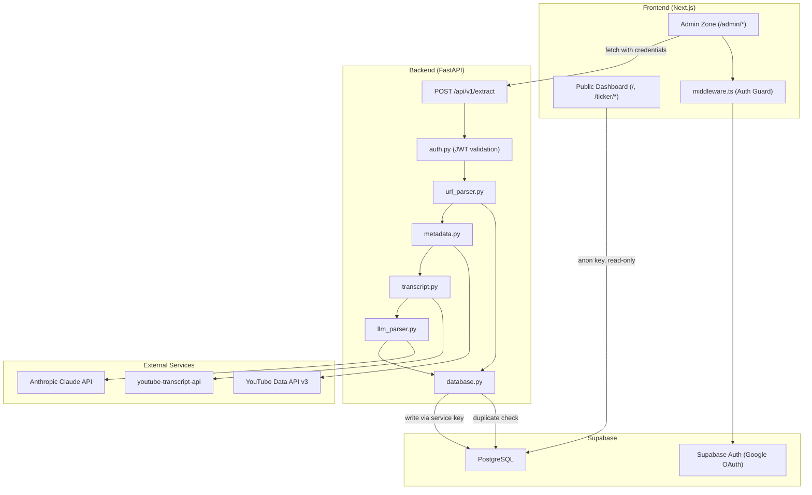

# Design Document

## Overview

YTPortfolio is a monorepo application with a Python/FastAPI backend handling the extraction pipeline and a Next.js frontend serving both the admin ingestion interface and public dashboard. The system uses Supabase for both database (PostgreSQL) and authentication (Google OAuth). The architecture is designed for single-user operation with public read access.

The backend exposes a single extraction endpoint that orchestrates: URL parsing → duplicate check → metadata fetch → transcript fetch → LLM parsing → database persistence. The frontend provides an authenticated admin zone for URL submission and a public dashboard for viewing aggregated stock recommendations.

## Architecture



## Components and Interfaces

### 1. Backend Components

| Component | File | Responsibility | Interface |
|-----------|------|---------------|-----------|
| URL Parser | `url_parser.py` | Extract Video_ID from YouTube URLs | `parse_url(url: str) -> ParsedURL` |
| Metadata Fetcher | `metadata.py` | Fetch channel name + publish date | `fetch_metadata(video_id: str) -> VideoMetadata` |
| Transcript Fetcher | `transcript.py` | Retrieve and concatenate transcript | `fetch_transcript(video_id: str) -> str` |
| LLM Parser | `llm_parser.py` | Extract recommendations via Claude | `parse_recommendations(transcript: str, metadata: VideoMetadata) -> list[Recommendation]` |
| Database Service | `database.py` | All PostgreSQL operations | `persist_extraction(channel: str, video: VideoData, recs: list[Recommendation]) -> None` |
| Auth Middleware | `auth.py` | JWT validation + owner check | FastAPI middleware dependency |

### 2. Frontend Components

| Component | Path | Responsibility |
|-----------|------|---------------|
| Auth Middleware | `middleware.ts` | Session validation for `/admin/*` routes |
| Ingestion Hub | `/admin/ingest/page.tsx` | URL input + submission UI |
| Aggregation Dashboard | `/page.tsx` | Public ticker table with weighted metrics |
| Ticker Detail View | `/ticker/[symbol]/page.tsx` | Chronological recommendation timeline |
| Auth Callback | `/auth/callback/route.ts` | OAuth code exchange |

### 3. Inter-Component Communication

```
Frontend (Admin) → FastAPI: HTTP POST with Bearer token
Frontend (Public) → Supabase: Direct query with anon key (read-only via RLS)
FastAPI → Supabase: Service key (bypasses RLS, full write access)
FastAPI → YouTube API: REST with API key
FastAPI → Anthropic: SDK with API key
```

## Data Models

### Pydantic Schemas (`schemas.py`)

```python
from pydantic import BaseModel, Field, field_validator
import re

class ExtractionRequest(BaseModel):
    youtube_url: str

class Recommendation(BaseModel):
    ticker: str = Field(..., min_length=1, max_length=5)
    sentiment: int = Field(..., ge=-2, le=2)
    target_price: float | None = None
    conviction_level: int = Field(..., ge=1, le=10)
    catalyst_notes: str = Field(..., min_length=1, max_length=500)

    @field_validator("ticker", mode="before")
    @classmethod
    def normalize_ticker(cls, v: str) -> str:
        """Post-process LLM output: uppercase, strip whitespace, replace periods with hyphens."""
        v = v.strip()
        v = v.upper()
        v = re.sub(r"\s+", "", v)
        v = v.replace(".", "-")
        return v

class LLMResponse(BaseModel):
    recommendations: list[Recommendation]

class ExtractionResponse(BaseModel):
    status: str = "success"
    channel_name: str
    video_id: str
    published_at: str
    tickers_extracted: list[str]
    recommendation_count: int

class ParsedURL(BaseModel):
    video_id: str
    canonical_url: str

class VideoMetadata(BaseModel):
    channel_name: str
    published_at: str  # ISO 8601
```

### Database Tables

| Table | Column | Type | Constraints |
|-------|--------|------|-------------|
| channels | channel_id | UUID | PK, default uuid_generate_v4() |
| channels | channel_name | TEXT | UNIQUE, NOT NULL |
| channels | trust_weight | FLOAT | NOT NULL, default 1.0 |
| channels | created_at | TIMESTAMPTZ | NOT NULL, default NOW() |
| videos | video_id | UUID | PK, default uuid_generate_v4() |
| videos | channel_id | UUID | FK → channels, NOT NULL |
| videos | video_url | TEXT | UNIQUE, NOT NULL |
| videos | youtube_video_id | TEXT | UNIQUE, NOT NULL |
| videos | published_at | TIMESTAMPTZ | NOT NULL |
| videos | extracted_at | TIMESTAMPTZ | NOT NULL, default NOW() |
| recommendations | id | UUID | PK, default uuid_generate_v4() |
| recommendations | video_id | UUID | FK → videos, NOT NULL |
| recommendations | ticker | TEXT | NOT NULL |
| recommendations | sentiment | INTEGER | NOT NULL, CHECK [-2, 2] |
| recommendations | target_price | FLOAT | nullable |
| recommendations | conviction_level | INTEGER | NOT NULL, CHECK [1, 10] |
| recommendations | catalyst_notes | TEXT | NOT NULL, default '' |

### Database DDL

```sql
CREATE EXTENSION IF NOT EXISTS "uuid-ossp";

-- Channels table
CREATE TABLE channels (
    channel_id UUID PRIMARY KEY DEFAULT uuid_generate_v4(),
    channel_name TEXT NOT NULL UNIQUE,
    trust_weight FLOAT NOT NULL DEFAULT 1.0,
    created_at TIMESTAMPTZ NOT NULL DEFAULT NOW()
);

-- Videos table
CREATE TABLE videos (
    video_id UUID PRIMARY KEY DEFAULT uuid_generate_v4(),
    channel_id UUID NOT NULL REFERENCES channels(channel_id) ON DELETE CASCADE,
    video_url TEXT NOT NULL UNIQUE,
    youtube_video_id TEXT NOT NULL UNIQUE,
    published_at TIMESTAMPTZ NOT NULL,
    extracted_at TIMESTAMPTZ NOT NULL DEFAULT NOW()
);

-- Recommendations table
CREATE TABLE recommendations (
    id UUID PRIMARY KEY DEFAULT uuid_generate_v4(),
    video_id UUID NOT NULL REFERENCES videos(video_id) ON DELETE CASCADE,
    ticker TEXT NOT NULL,
    sentiment INTEGER NOT NULL CHECK (sentiment BETWEEN -2 AND 2),
    target_price FLOAT,
    conviction_level INTEGER NOT NULL CHECK (conviction_level BETWEEN 1 AND 10),
    catalyst_notes TEXT NOT NULL DEFAULT ''
);

-- Indexes
CREATE INDEX idx_recommendations_ticker ON recommendations(ticker);
CREATE INDEX idx_videos_youtube_video_id ON videos(youtube_video_id);

-- Row Level Security
-- RLS is enabled to restrict the frontend anon key to read-only access.
-- The backend uses SUPABASE_SERVICE_KEY which bypasses RLS entirely,
-- so write policies are NOT needed (and would be redundant/misleading).
ALTER TABLE channels ENABLE ROW LEVEL SECURITY;
ALTER TABLE videos ENABLE ROW LEVEL SECURITY;
ALTER TABLE recommendations ENABLE ROW LEVEL SECURITY;

-- Public read policies (restricts anon key to SELECT only)
CREATE POLICY "Public read channels" ON channels FOR SELECT USING (true);
CREATE POLICY "Public read videos" ON videos FOR SELECT USING (true);
CREATE POLICY "Public read recommendations" ON recommendations FOR SELECT USING (true);

-- No write policies defined. The FastAPI backend uses SUPABASE_SERVICE_KEY
-- which operates as a superuser and bypasses RLS. Adding INSERT/UPDATE/DELETE
-- policies with WITH CHECK (true) would be pointless noise.
```

### Channel Upsert Pattern

The channel upsert uses `ON CONFLICT ... DO UPDATE` (not `DO NOTHING`) to guarantee `RETURNING` always yields the `channel_id`:

```sql
INSERT INTO channels (channel_name)
VALUES ($1)
ON CONFLICT (channel_name)
DO UPDATE SET channel_name = EXCLUDED.channel_name
RETURNING channel_id;
```

**Rationale:** `ON CONFLICT DO NOTHING` causes `RETURNING` to yield an empty result set when the row already exists, which breaks the subsequent video insert that depends on the `channel_id` foreign key. The `DO UPDATE SET channel_name = EXCLUDED.channel_name` is a no-op update that forces PostgreSQL to return the existing row.

## Technology Stack

| Layer | Technology | Purpose |
|-------|-----------|---------|
| Backend Runtime | Python 3.12+ | API server and pipeline logic |
| Backend Framework | FastAPI | REST API with async support |
| Transcript Fetching | youtube-transcript-api | Fetch YouTube captions |
| Video Metadata | YouTube Data API v3 | Channel name, publish date |
| AI Extraction | Anthropic API (Claude Sonnet) | Structured recommendation parsing |
| Database | Supabase PostgreSQL | Relational data storage |
| Auth | Supabase Auth (Google OAuth) | Single-user authentication |
| Frontend Framework | Next.js 14+ (App Router) | React server components, middleware |
| UI Components | shadcn/ui + Tailwind CSS | Prebuilt accessible components |
| Frontend DB Client | @supabase/supabase-js | Direct read queries from frontend |
| Frontend Auth | @supabase/ssr | Server-side session management |

## Component Design Details

### URL Parser (`url_parser.py`)

- Regex patterns support `youtube.com/watch?v=`, `youtu.be/`, `youtube.com/shorts/`, and `youtube.com/embed/`
- Extracts the 11-character Video_ID
- Strips extra query parameters (`&t=`, `&list=`, etc.)
- Returns a normalized canonical URL (`https://www.youtube.com/watch?v={video_id}`)

### Metadata Fetcher (`metadata.py`)

- Calls YouTube Data API v3 `videos.list` endpoint with `snippet` part
- Extracts `snippet.channelTitle` and `snippet.publishedAt`
- 10-second timeout for connection and response
- Returns typed `VideoMetadata` model

### Transcript Fetcher (`transcript.py`)

- Uses `YouTubeTranscriptApi.get_transcript(video_id)`
- Concatenates all `text` fields with single space separator
- Catches `TranscriptsDisabled` and `NoTranscriptFound` exceptions

### LLM Parser (`llm_parser.py`)

- Uses `anthropic` Python SDK with `claude-sonnet` model
- Sends system prompt with strict JSON schema definition
- Includes channel name and publish date in user message as context
- Validates response against Pydantic `LLMResponse` model
- **Ticker normalization** happens automatically via the `Recommendation.normalize_ticker` field validator — the LLM's raw output (e.g., "brk.b", "BRK B", " AAPL ") is cleaned before database insertion
- Retry logic: single retry on schema validation failure; exponential backoff (1s, 2s, 4s) on rate limit (429)

### Database Service (`database.py`)

- Uses `supabase-py` client with `SUPABASE_SERVICE_KEY` (bypasses RLS)
- **Channel upsert**: `INSERT ... ON CONFLICT (channel_name) DO UPDATE SET channel_name = EXCLUDED.channel_name RETURNING channel_id` — guarantees UUID is always returned
- **Transaction**: channel upsert → video insert → recommendations batch insert
- Rollback on any failure during video/recommendations insert
- Duplicate check: query videos table by `youtube_video_id` before pipeline execution

### Auth Middleware (`auth.py`)

- Extracts `Authorization: Bearer <token>` header
- Validates JWT using Supabase's JWT secret
- Case-insensitive comparison of `email` claim against `OWNER_EMAIL`
- Returns 401 for missing/invalid tokens, 403 for wrong email

### Pipeline Execution Order

```
1. Validate URL → Extract Video_ID
2. Check database for existing Video_ID (fail fast: 409)
3. Fetch metadata from YouTube Data API v3
4. Fetch transcript from youtube-transcript-api
5. Send transcript + metadata to Anthropic API
6. Validate LLM response against schema (retry once if invalid)
7. Ticker normalization via Pydantic field_validator (automatic)
8. Insert channel (upsert with RETURNING), video, recommendations (transactional)
9. Return 201 with extracted tickers
```

### API Contract

**POST /api/v1/extract**

Request:
```json
{
  "youtube_url": "https://www.youtube.com/watch?v=abc123xyz99"
}
```

Success Response (201):
```json
{
  "status": "success",
  "channel_name": "Financial Education",
  "video_id": "abc123xyz99",
  "published_at": "2024-01-15T10:30:00Z",
  "tickers_extracted": ["AAPL", "TSLA", "NVDA"],
  "recommendation_count": 3
}
```

Error Responses:
| Status | Condition |
|--------|-----------|
| 400 | Invalid URL format |
| 401 | Unauthenticated request |
| 403 | Authenticated but not owner |
| 404 | Video does not exist on YouTube |
| 409 | Video already processed |
| 422 | Transcript unavailable or invalid request body |
| 429 | Rate limited (AI service) |
| 500 | Database error |
| 502 | LLM parsing failure / YouTube API failure |
| 503 | External service unreachable |

### LLM Prompt Design

**System Prompt:**
```
You are a financial analyst assistant. Your task is to extract stock recommendations 
from YouTube video transcripts. For each stock mentioned with a clear recommendation, 
extract the ticker symbol, sentiment, target price (if mentioned), conviction level, 
and catalyst notes.

Sentiment scale: -2 (strong sell), -1 (sell/bearish), 0 (neutral/hold), 
1 (buy/bullish), 2 (strong buy)

Conviction level: 1 (passing mention) to 10 (highest conviction, portfolio cornerstone)

Only include stocks where the speaker expresses a clear directional opinion.
Do not include stocks merely mentioned in passing without a recommendation.
```

### Frontend Key Decisions

**Aggregation Query (server component):**
```sql
SELECT 
  r.ticker,
  SUM(r.sentiment * c.trust_weight) / SUM(c.trust_weight) AS consensus_sentiment,
  AVG(r.target_price) FILTER (WHERE r.target_price IS NOT NULL) AS avg_target_price,
  COUNT(*) AS mention_count
FROM recommendations r
JOIN videos v ON r.video_id = v.video_id
JOIN channels c ON v.channel_id = c.channel_id
GROUP BY r.ticker
ORDER BY mention_count DESC
```

**Environment Configuration:**

Backend `.env.example`:
```
SUPABASE_URL=https://your-project.supabase.co
SUPABASE_SERVICE_KEY=your-service-role-key
SUPABASE_JWT_SECRET=your-jwt-secret
ANTHROPIC_API_KEY=your-anthropic-api-key
YOUTUBE_API_KEY=your-youtube-data-api-key
OWNER_EMAIL=your-email@gmail.com
CORS_ORIGINS=http://localhost:3000
```

Frontend `.env.example`:
```
NEXT_PUBLIC_SUPABASE_URL=https://your-project.supabase.co
NEXT_PUBLIC_SUPABASE_ANON_KEY=your-anon-key
NEXT_PUBLIC_BACKEND_URL=http://localhost:8000
NEXT_PUBLIC_OWNER_EMAIL=your-email@gmail.com
```

## Correctness Properties

*A property is a characteristic or behavior that should hold true across all valid executions of a system—essentially, a formal statement about what the system should do. Properties serve as the bridge between human-readable specifications and machine-verifiable correctness guarantees.*

### Property 1: URL Parsing Roundtrip

*For any* valid YouTube Video_ID embedded in any supported URL format (watch?v=, youtu.be/, shorts/, embed/, with or without extra query parameters), parsing the URL to extract the Video_ID and reconstructing the canonical URL shall yield the same Video_ID when parsed again.

**Validates: Requirements 1.1**

### Property 2: Ticker Normalization Idempotence

*For any* string representing a ticker symbol output by the LLM, applying the normalization function (uppercase, strip whitespace, replace periods with hyphens) once shall produce the same result as applying it multiple times. Additionally, for any two strings that differ only in case, whitespace, or period-vs-hyphen separators, normalization shall produce identical output.

**Validates: Requirements 2.6**

### Property 3: Recommendation Schema Validation

*For any* integer value for sentiment, the Pydantic model shall accept it if and only if it is in [-2, 2]. *For any* integer value for conviction_level, the model shall accept it if and only if it is in [1, 10]. *For any* string value for catalyst_notes, the model shall accept it if and only if its length is between 1 and 500 characters inclusive.

**Validates: Requirements 2.3, 2.4, 2.5**

### Property 4: Channel Upsert Always Returns UUID

*For any* channel name (whether new or already existing in the database), the upsert operation shall always return a valid UUID channel_id, never an empty result set.

**Validates: Requirements 3.1**

### Property 5: Transaction Atomicity

*For any* pipeline execution, either all database records (channel, video, and all recommendations) are persisted, or none are. There shall never exist a video record without its corresponding recommendations batch, nor a recommendation without its parent video.

**Validates: Requirements 3.5**

### Property 6: Aggregation Correctness

*For any* set of recommendations for a given ticker, the consensus sentiment shall equal `SUM(sentiment × trust_weight) / SUM(trust_weight)` rounded to two decimal places. The average target price shall equal the arithmetic mean of all non-null target_price values; if all are null, it shall display "N/A". Results shall be sorted by mention count descending.

**Validates: Requirements 7.3, 7.4**

### Property 7: Case-Insensitive Ticker Lookup

*For any* ticker symbol stored in the database and any case variation of that symbol provided in the URL path, the Ticker Detail View shall return the same set of recommendations.

**Validates: Requirements 8.2**

### Property 8: Exponential Backoff Timing

*For any* sequence of rate limit (429) responses from the Anthropic API, the retry delays shall follow the pattern 1s, 2s, 4s (doubling each attempt), with a maximum of 3 retries before returning a 429 to the caller.

**Validates: Requirements 11.1**

## Error Handling

### Error Classification

| Error Source | HTTP Status | Retry Strategy | User Message |
|-------------|-------------|----------------|--------------|
| Invalid URL | 400 | None | "URL format not recognized" |
| Missing auth | 401 | None | "Authentication required" |
| Wrong user | 403 | None | "Not authorized" |
| Video not on YouTube | 404 | None | "Video not found on YouTube" |
| Duplicate video | 409 | None | "Video already processed" |
| No transcript | 422 | None | "Transcript unavailable for this video" |
| Invalid request body | 422 | None | Pydantic validation details |
| LLM rate limited | 429 | Exponential backoff (3 retries) | "AI service busy, try again later" |
| Database failure | 500 | None (rollback) | "Internal error, please try again" |
| LLM parse failure | 502 | Single retry | "Could not parse recommendations" |
| YouTube API failure | 502 | None | "Could not retrieve video metadata" |
| Service timeout | 503 | None | "Service temporarily unavailable" |

### Timeout Configuration

| Service | Connect Timeout | Read Timeout |
|---------|----------------|--------------|
| Anthropic API | 10s | 30s |
| Supabase | 5s | 10s |
| YouTube Data API | 10s | 10s |

### Logging Strategy

All errors are logged with structured context:
```python
{
    "youtube_url": str,
    "pipeline_stage": "url_parsing" | "duplicate_check" | "metadata_fetch" | "transcript_fetch" | "llm_parse" | "database_insert",
    "timestamp": str,  # ISO 8601
    "error_type": str,
    "error_details": str
}
```

### Transaction Rollback

If any database operation fails after the channel upsert:
1. The video insert and all recommendation inserts for that request are rolled back
2. The channel upsert is NOT rolled back (channels are shared across videos and the upsert is idempotent)
3. An HTTP 500 is returned with a generic error message

## Testing Strategy

### Unit Tests (pytest)

- **URL Parser**: Test all supported formats, edge cases (extra params, malformed URLs)
- **Ticker Normalization**: Test case conversion, whitespace stripping, period-to-hyphen replacement
- **Schema Validation**: Test boundary values for sentiment, conviction, catalyst_notes length
- **Aggregation Logic**: Test weighted average formula with known inputs

### Property-Based Tests (Hypothesis)

The project uses [Hypothesis](https://hypothesis.readthedocs.io/) for property-based testing in Python.

Configuration:
- Minimum 100 examples per property test
- Each test references its design document property via comment tag
- Tag format: `# Feature: ytportfolio, Property {N}: {title}`

Properties to implement:
1. URL Parsing Roundtrip — generate random 11-char video IDs, embed in random URL formats, verify roundtrip
2. Ticker Normalization Idempotence — generate random ticker-like strings, verify f(f(x)) == f(x) and case/whitespace/separator equivalence
3. Recommendation Schema Validation — generate random integers and strings, verify acceptance/rejection boundaries
4. Channel Upsert Always Returns UUID — generate random channel names, run upsert with mock, verify UUID returned
5. Aggregation Correctness — generate random recommendation sets with known weights, verify formula

### Integration Tests

- Full pipeline execution with mocked external services
- Auth flow (valid token, invalid token, wrong email)
- Database transaction rollback on simulated failure
- Duplicate video detection

### Frontend Tests

- Component tests (Ingestion Hub form behavior, toast notifications)
- Navigation tests (ticker row click → detail view)
- Empty state rendering

### End-to-End Tests

- Authenticated submission → extraction → dashboard display
- Public dashboard loads without auth
- Ticker detail view with case-insensitive URL
