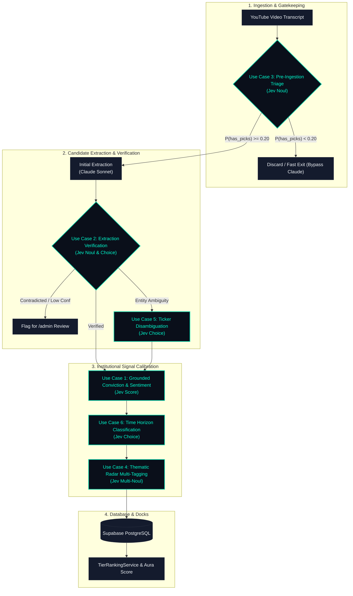

# TypeSafe Jev Model Integration: Prioritized Use Cases & Roadmap

> **Author:** Aura Architecture  
> **Date:** 2026-09-19  
> **Status:** Approved Blueprint & Implementation Roadmap  
> **Focus:** TypeSafe AI System One (`jev-latest` / `jev-1.13`) Integration

---

## 1. Executive Summary & Architectural Overview

Aura's platform mission is **"Every stock analyst. One clear signal."** To deliver institutional-grade conviction signals from YouTube finance channels, Aura currently relies on Claude Sonnet (`claude-sonnet-5`) in [`backend/app/llm_parser.py`](file:///Users/noor/Projects/irec/backend/app/llm_parser.py) for full-video transcript extraction.

While generative LLMs excel at free-form synthesis (e.g. `video_summary`), using them for numerical ratings, boolean triage, and strict schema validation introduces:
1. **Generative Drift & Calibration Loss:** Asking a generative model for an integer conviction level (`1..10`) or sentiment (`-2..2`) produces inconsistent, arbitrary values that lack mathematical calibration across channels.
2. **Hallucination Risk:** Attributing competitor tickers, historical target prices, or illustrative examples as active buy/sell recommendations.
3. **High Latency & Token Waste:** Ingesting 15,000–30,000 token transcripts into heavy frontier models for videos that contain zero stock recommendations (e.g. macro market reviews, educational podcasts).

### The System One Paradigm (Jev)
TypeSafe's **Jev** is a **System One model** designed for fast (~100ms), low-cost ($0.042/1M input tokens, free output tokens) structured decisions. Rather than generating text, it evaluates an application state against typed primitives:
* **`Score`**: Probability-weighted position over ordered descriptive criteria levels + confidence score.
* **`Noul`**: Calibrated probability ($0.0$ to $1.0$) of whether a specific condition holds.
* **`Choice`**: Single selection from discrete options with a calibrated probability distribution across all choices.

In Aura's architecture, **Code owns the workflow and deterministic checks**, **Jev provides fast, calibrated semantic judgments**, and **Claude handles deep unstructured synthesis only when needed**.



---

## 2. Prioritized Use Cases

The use cases are ranked from **highest impact (core data calibration & critical cost savings)** to **less critical (supplementary UX and search enhancements)**.

---

### Use Case 1 (Priority #1): Calibrated Conviction & Sentiment Scoring via Jev `Score`

* **Primitive:** [`Score`](https://docs.typesafe.ai/primitives/score.md)
* **Status:** ✅ **COMPLETED & DEPLOYED IN PRODUCTION** (100% of recommendations calibrated, live in backend pipeline & frontend UI)
* **Target Files:**
  - [`backend/app/llm_parser.py`](file:///Users/noor/Projects/irec/backend/app/llm_parser.py)
  - [`backend/app/typesafe_service.py`](file:///Users/noor/Projects/irec/backend/app/typesafe_service.py)
  - [`backend/app/schemas.py`](file:///Users/noor/Projects/irec/backend/app/schemas.py)
  - [`backend/app/admin_routes.py`](file:///Users/noor/Projects/irec/backend/app/admin_routes.py)
  - [`frontend/src/app/admin/manage/tabs/recommendations-tab.tsx`](file:///Users/noor/Projects/irec/frontend/src/app/admin/manage/tabs/recommendations-tab.tsx)
  - [`frontend/src/components/TickerSignalsLedger.tsx`](file:///Users/noor/Projects/irec/frontend/src/components/TickerSignalsLedger.tsx)

#### Problem
In [`schemas.py`](file:///Users/noor/Projects/irec/backend/app/schemas.py#L13-L15), conviction is defined as `int 1 to 10` and sentiment as `int -2 to 2`. Prompting Claude for raw integers produces subjective drift:
- Different channels get different score distributions for the exact same phrasing.
- Integers lack continuous granularity (e.g. an analyst with 65% bullish probability is forced into 1 or 2).
- Downstream rankings in [`TierRankingService.compute_priority_scores()`](file:///Users/noor/Projects/irec/backend/app/tier_ranking_service.py#L89-L95) rely heavily on `norm_conviction` and `abs_sentiment`.

#### Jev Solution
Evaluate the recommendation's transcript snippet against explicit, self-contained semantic levels. Jev computes the expected value over the probability distribution:

```python
from typesafe_sdk import TypeSafeClient, Score

client = TypeSafeClient(api_key=os.environ["TYPESAFE_API_KEY"])

questions = {
    "calibrated_conviction": Score(
        instructions="Rate the analyst's conviction level on {ticker} based on their thesis in the transcript snippet.",
        criteria=[
            "Passing mention, watch-list note, or hedging example; no active capital commitment.",
            "Mild or speculative interest; small starter position or technical watchlist candidate.",
            "Standard high-probability thesis backed by business fundamentals, valuation, or clear chart setup.",
            "High-conviction idea; top-tier sector allocation, explicit price target, or overweight stance.",
            "All-in / flagship conviction; cornerstone portfolio holding, maximum allocation, multi-year core bet."
        ]
    ),
    "calibrated_sentiment": Score(
        instructions="Score the analyst's directional sentiment towards {ticker}.",
        criteria=[
            "Strongly bearish: capital liquidation, short position, or warning of severe downside.",
            "Mildly bearish: trimming position, downgrading target, or expressing heightened macro caution.",
            "Neutral / hold: balanced risk-reward, awaiting earnings/catalyst before taking action.",
            "Mildly bullish: accumulating small tranches, constructive chart, favorable valuation.",
            "Strongly bullish: aggressive accumulation, top buy pick, major upside target."
        ]
    )
}
```

#### Outcome
* Yields continuous float scores (e.g. `conviction: 3.42 / 4.0` normalized to `8.55 / 10.0`).
* Provides `confidence` metrics for each score, allowing Aura to highlight high-confidence consensus picks.

---

### Use Case 2 (Priority #2): Structured Extraction Verification & Cascade (Hallucination Guardrail)

* **Primitives:** [`Noul`](https://docs.typesafe.ai/primitives/noul.md), [`Choice`](https://docs.typesafe.ai/primitives/choice.md)
* **Cookbooks:** [SDE Cascade](https://docs.typesafe.ai/cookbooks/sde_cascade.md), [Citation Check](https://docs.typesafe.ai/cookbooks/citation_check.md)
* **Target Files:**
  - [`backend/app/llm_parser.py`](file:///Users/noor/Projects/irec/backend/app/llm_parser.py#L240-L258)
  - [`backend/app/admin_routes.py`](file:///Users/noor/Projects/irec/backend/app/admin_routes.py)

#### Problem
Finance YouTube videos are conversational. Common extraction failures include:
1. Extracting a stock that was mentioned only as a peer comparison or negative foil.
2. Inaccurate `catalyst_notes` attributing one company's earnings beat to another stock discussed in the same segment.
3. Hallucinating explicit `target_price` numbers mentioned in passing from third-party analysts.

#### Jev Solution
Run an **SDE Verification Cascade** immediately after recommendation parsing. For each candidate pick, verify the extracted fields against the supporting transcript snippet:

```python
from typesafe_sdk import Choice, Noul

questions = {
    "thesis_grounded": Choice(
        instructions="Does the excerpt support the extracted catalyst thesis for {ticker}?",
        criteria={
            "supports": "The speaker explicitly presents this thesis as their stance on {ticker}.",
            "contradicts": "The speaker actually expresses the opposite or disavows this thesis.",
            "unsupported": "The thesis is fabricated or refers to a different company mentioned in the video."
        }
    ),
    "is_real_recommendation": Noul(
        instructions="Does the speaker express an active, directional investment or trading opinion on {ticker}, rather than merely citing it in passing?"
    ),
    "price_target_verified": Choice(
        instructions="Does the speaker state an explicit price target of {target_price} for {ticker}?",
        criteria={
            "verified": "The price target was explicitly stated by the speaker for this stock.",
            "third_party": "The speaker was quoting someone else (e.g. Wall St consensus) or historical price.",
            "unmentioned": "No such price target was articulated for this stock."
        }
    )
}
```

#### Policy & Workflow
* If `is_real_recommendation < 0.35` $\rightarrow$ Drop recommendation automatically.
* If `thesis_grounded.choice != "supports"` or `confidence < 0.80` $\rightarrow$ Flag for admin moderation in [`admin_routes.py`](file:///Users/noor/Projects/irec/backend/app/admin_routes.py) with status `needs_review`.
* If `price_target_verified.choice != "verified"` $\rightarrow$ Strip `target_price = None` to preserve data integrity.

---

### Use Case 3 (Priority #3): Pre-Ingestion Video Triage (Cost & Latency Gatekeeper)

* **Primitive:** [`Noul`](https://docs.typesafe.ai/primitives/noul.md)
* **Target Files:**
  - [`backend/app/main.py`](file:///Users/noor/Projects/irec/backend/app/main.py#L200-L225)
  - [`worker/src/index.js`](file:///Users/noor/Projects/irec/worker/src/index.js)

#### Problem
Currently, 100% of fetched transcripts are fed into Claude Sonnet (`max_tokens=16384`). Over 30% of finance videos are pure macro discussion (Fed rate forecasts, CPI prints), crypto gossip, or educational tutorials with zero single-stock actionable calls. Sending 25k-token transcripts to Claude costs ~$0.08–$0.15 per video and takes 10–25 seconds of pipeline execution.

#### Jev Solution
Run a sub-second pre-filter over the video title and first 3,000 words of transcript:

```python
state = {
    "video_title": metadata.title,
    "channel_name": metadata.channel_name,
    "transcript_sample": transcript[:4000]
}

questions = {
    "has_actionable_recommendations": Noul(
        instructions="Does this video contain specific, actionable stock or ETF buy/sell/hold recommendations, rather than exclusively general macroeconomic or educational market recap?"
    )
}
```

#### Outcome
* If $P(\text{has\_actionable\_recommendations}) < 0.20$, store the video record with `recommendation_count: 0` and skip Claude entirely.
* **Saves ~35% of monthly Anthropic API consumption** and cuts ingestion latency from 20s to <1s for non-trade videos.

---

### Use Case 4 (Priority #4): Stock Radar Thematic Tagging & Multi-Label Classification

* **Primitives:** Parallel [`Noul`](https://docs.typesafe.ai/primitives/noul.md) questions
* **Documentation Reference:** [Parallel Questions](https://docs.typesafe.ai/cookbooks/parallel_questions.md)
* **Target Files:**
  - [`backend/app/radars_routes.py`](file:///Users/noor/Projects/irec/backend/app/radars_routes.py)
  - [`radars_implementation_plan.md`](file:///Users/noor/Projects/irec/radars_implementation_plan.md)
  - [`backend/seed_radars.py`](file:///Users/noor/Projects/irec/backend/seed_radars.py)

#### Problem
Aura's Radars (`MANGOS`, `AI Infrastructure`, `GLP-1 & Bio`, `Bitcoin Proxies`, `Defense & Aero`) currently use static ticker lists. When an analyst covers a stock through a specific thematic lens (e.g. reviewing `GEV` or `CEG` purely as an AI compute power play, or `NVDA` purely as a sovereign AI play), static mapping fails to reflect why the stock was chosen.

#### Jev Solution
Batch parallel `Noul` questions over the recommendation's catalyst notes to tag themes dynamically:

```python
questions = {
    "radar_ai_infra": Noul(
        instructions="Is this recommendation driven by AI compute, data center hardware, power/cooling infrastructure, or semiconductor equipment?"
    ),
    "radar_glp1_biotech": Noul(
        instructions="Is this thesis related to GLP-1 weight loss drugs, obesity therapeutics, or biotech drug pipelines?"
    ),
    "radar_bitcoin_crypto": Noul(
        instructions="Is this pick treated as a direct or indirect proxy for Bitcoin, crypto adoption, or digital asset treasury strategy?"
    ),
    "radar_defense_aero": Noul(
        instructions="Is this pick driven by defense contracting, military spending, or aerospace demand?"
    ),
}
```

#### Outcome
* Dynamically associates recommendations with curated Radars.
* Powers the Radar Detail view (`/radars/[slug]`) with relevant video cards and catalyst excerpts.

---

### Use Case 5 (Priority #5): Ticker & Entity Disambiguation (Spoken Words to Symbols)

* **Primitive:** [`Choice`](https://docs.typesafe.ai/primitives/choice.md)
* **Cookbook Reference:** [Entity Alignment](https://docs.typesafe.ai/cookbooks/entity_alignment.md)
* **Target Files:**
  - [`backend/app/ticker_validator.py`](file:///Users/noor/Projects/irec/backend/app/ticker_validator.py)
  - [`backend/app/ticker_names.py`](file:///Users/noor/Projects/irec/backend/app/ticker_names.py)

#### Problem
YouTube transcripts transcribe speech colloquially:
- *"Square"* $\rightarrow$ Is it `SQ` (Block, Inc.) or `SQSP` (Squarespace)?
- *"Virgin"* $\rightarrow$ Is it `SPCE` (Virgin Galactic) or something else?
- *"OpenAI"* / *"SpaceX"* $\rightarrow$ Both private. Should Aura tag pseudo-tickers `OAI` / `SPCX` or listed proxies like `MSFT`?

#### Jev Solution
When string matching or `yfinance` produces candidate ambiguities, use Jev `Choice`:

```python
state = {
    "context_sentence": "I'm doubling down on Square here because their Cash App monetization is outpacing expectations.",
    "candidates": ["SQ", "SQSP", "NONE"]
}

questions = {
    "resolved_symbol": Choice(
        instructions="Which ticker symbol correctly represents the company the speaker is discussing?",
        criteria={
            "SQ": "Block, Inc. (Cash App, Square terminal payments)",
            "SQSP": "Squarespace, Inc. (website builder and hosting platform)",
            "NONE": "Neither company or context is ambiguous"
        }
    )
}
```

---

### Use Case 6 (Priority #6): Investment Time Horizon & Strategy Classification

* **Primitive:** [`Choice`](https://docs.typesafe.ai/primitives/choice.md)
* **Target Files:**
  - [`backend/app/schemas.py`](file:///Users/noor/Projects/irec/backend/app/schemas.py)
  - [`frontend/src/app/today/page.tsx`](file:///Users/noor/Projects/irec/frontend/src/app/today/page.tsx)
  - [`frontend/src/app/explore/page.tsx`](file:///Users/noor/Projects/irec/frontend/src/app/explore/page.tsx)

#### Problem
In the UI, a day-trade options scalp on `TSLA` earnings appears right next to a 5-year value compounder thesis on `GOOGL`. Users screening recommendations need to filter by strategy.

#### Jev Solution
Classify the investment time horizon into a typed database column:

```python
questions = {
    "time_horizon": Choice(
        instructions="What is the stated or implied investment time horizon for this recommendation?",
        criteria={
            "scalp_or_day": "Intraday trade, 0DTE / weekly options, or immediate volatility scalp.",
            "swing_trade": "1 to 8 weeks; earnings catalyst, chart breakout, or swing momentum.",
            "position_trade": "3 to 12 months; cyclical rebound or medium-term fundamental turnaround.",
            "long_term": "Multi-year secular compounder / buy-and-hold thesis.",
            "unspecified": "No time horizon indicated."
        }
    )
}
```

---

### Use Case 7 (Priority #7): Natural Language Screener Query Routing

* **Primitives:** [`Choice`](https://docs.typesafe.ai/primitives/choice.md), [Function Calling Pattern](https://docs.typesafe.ai/cookbooks/function_calling.md)
* **Target Files:**
  - [`backend/app/stocks_routes.py`](file:///Users/noor/Projects/irec/backend/app/stocks_routes.py)
  - [`frontend/src/app/explore/page.tsx`](file:///Users/noor/Projects/irec/frontend/src/app/explore/page.tsx)

#### Problem
Users on `/explore` want to type natural-language screener queries (e.g. *"Show high conviction semiconductor long trades from the last 7 days"*). Parsing free-form user text into SQL filters usually requires brittle regex or slow multi-turn tool-calling LLMs.

#### Jev Solution
In a single ~120ms request, extract structured query filters:
```python
questions = {
    "direction": Choice(instructions="Sentiment direction", criteria={"bullish": "Long / buy", "bearish": "Short / sell", "any": "All"}),
    "min_conviction": Choice(instructions="Conviction constraint", criteria={"high": "High conviction (>=8)", "all": "Any"}),
    "sector": Choice(instructions="Sector filter", criteria={"semi": "Semiconductors", "ai": "AI & Software", "bio": "Healthcare/Biotech", "all": "All sectors"}),
    "time_window": Choice(instructions="Lookback window", criteria={"7d": "Past 7 days", "30d": "Past 30 days", "all": "All time"})
}
```

---

## 3. Comparison Matrix

| # | Use Case | TypeSafe Primitive | Latency Impact | Cost Impact | Primary Impact Area |
|---|:---|:---:|:---:|:---:|:---|
| **1** | **Calibrated Conviction & Sentiment** | `Score` | +80ms | Negligible | Core algorithm & consensus signal accuracy |
| **2** | **Extraction Verification Cascade** | `Noul` + `Choice` | +120ms (parallel) | Net negative (prevents re-runs) | Data integrity; zero hallucinated price targets |
| **3** | **Pre-Ingestion Video Triage** | `Noul` | -18s on filtered videos | **Saves ~35% on Anthropic bills** | Eliminates wasted full-transcript LLM runs |
| **4** | **Thematic Radar Tagging** | Parallel `Noul` | +90ms (batched) | Minimal | Dynamic classification into Radars |
| **5** | **Ticker Disambiguation** | `Choice` | +70ms (conditional) | Minimal | High entity resolution on phonetic tickers |
| **6** | **Time Horizon Classification** | `Choice` | Part of batch | Minimal | Adds screener filters (Swing vs Long-term) |
| **7** | **NL Screener Query Routing** | `Choice` / Function | ~120ms | Minimal | Fast search intent to SQL parameterization |

---

## 4. Phased Implementation Roadmap

### Phase 1: Efficiency & Core Signal Calibration (Immediate Wins)
1. **Use Case 1 (Calibrated Conviction & Sentiment):** ✅ **COMPLETED** — Post-extraction continuous 0–100 scoring in [`backend/app/typesafe_service.py`](file:///Users/noor/Projects/irec/backend/app/typesafe_service.py) & [`backend/app/llm_parser.py`](file:///Users/noor/Projects/irec/backend/app/llm_parser.py), fail-open database migrations, 100% database backfilled (0 uncalibrated signals), and UI updated.
2. **Use Case 3 (Pre-Ingestion Triage):** Add `triage_video_transcript()` in [`backend/app/transcript.py`](file:///Users/noor/Projects/irec/backend/app/transcript.py). If $P(\text{has\_actionable\_recommendations}) < 0.20$, exit early.

### Phase 2: Quality Guardrails & Entity Disambiguation
3. **Use Case 2 (Verification Cascade & Price Target Guardrail):** 🟡 **NEXT UP** — Add `verify_recommendations()` in [`llm_parser.py`](file:///Users/noor/Projects/irec/backend/app/llm_parser.py). Verify thesis grounding, genuine analyst conviction, and validate price targets. Route low-confidence/contradicted picks to the `/admin` moderation queue.
4. **Implement Use Case 5 (Ticker Disambiguation):** Integrate Jev `Choice` into [`ticker_validator.py`](file:///Users/noor/Projects/irec/backend/app/ticker_validator.py) when fuzzy matching yields multiple candidates.

### Phase 3: Metadata Enrichment & Radars
5. **Implement Use Case 4 (Thematic Radar Tagging):** Run radar multi-tagging in [`backend/app/radars_routes.py`](file:///Users/noor/Projects/irec/backend/app/radars_routes.py) on new extractions.
6. **Implement Use Case 6 (Time Horizon):** Add `time_horizon` column to `recommendations` table in Supabase and display badge on the Today feed.

### Phase 4: Frontend Interaction
7. **Implement Use Case 7 (NL Screener Search):** Expose `/api/v1/stocks/screener/parse-query` in [`stocks_routes.py`](file:///Users/noor/Projects/irec/backend/app/stocks_routes.py) to power natural language filter pills on `/explore`.

---

## 5. References & Documentation
* [TypeSafe Docs Index](https://docs.typesafe.ai/llms.txt)
* [System One Conceptual Guide](https://docs.typesafe.ai/concepts/system-one.md)
* [Building with System One](https://docs.typesafe.ai/concepts/how-to-build-with-system-one.md)
* [Structured Data Extraction Cascade Cookbook](https://docs.typesafe.ai/cookbooks/sde_cascade.md)
* [Citation Double-Checking Cookbook](https://docs.typesafe.ai/cookbooks/citation_check.md)
* [Composite Scoring Pattern](https://docs.typesafe.ai/patterns/composite-scoring.md)
